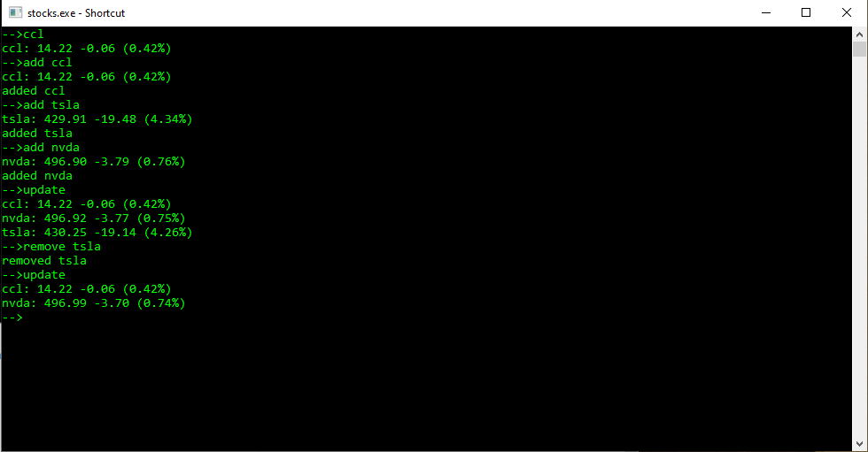

# Portfolio

This application can both check real time stock prices and keep a watchlist of all the stocks you want to keep track off.
The command line interface uses 4 keywords:
**add**{name}(add a specified stock),
**remove**{name}(remove a specified stock),
**update**(list current prices of tracked stocks)
**exit**(close the aplication).

You can also type the name of a stock to get it's price without adding it to your watchlist.
It's advisable to search for a stock based on its' ticker symbol but searching for a company by name typically works just as well.
If you add a company to your watchlist by name rather than ticker symbol it will be stored on your watchlist as such.
